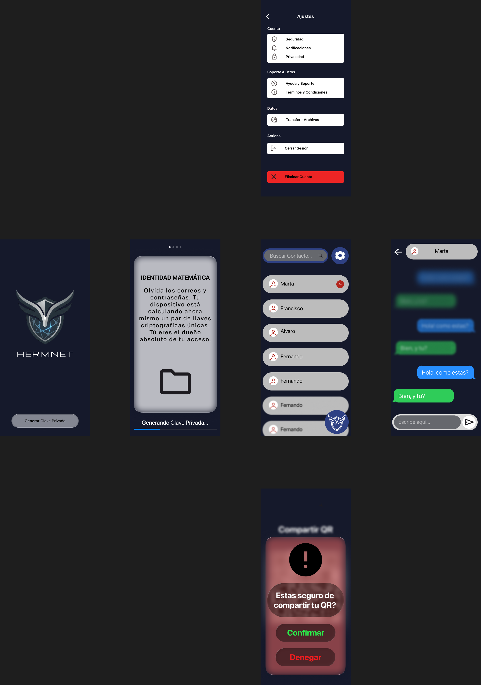



<h2 align="center">ÍNDICE</h2>

1. [El Flujo de la Aplicación: De principio a fin](#1-el-flujo-de-la-aplicación-de-principio-a-fin)
2. [Resumen de Tecnologías](#2-resumen-de-tecnologías)
3. [Estructura de las Bases de Datos](#3-estructura-de-las-bases-de-datos)
4. [Boceto Conceptual de la Interfaz](#4-boceto-conceptual-de-la-interfaz)

# 1. El Flujo de la Aplicación: De principio a fin

### Paso 1: Tu Pasaporte Digital (Identidad)

Al abrir la app por primera vez, no te pedimos ni tu número de teléfono ni tu correo. El móvil genera automáticamente un Par de Claves (una privada que nunca sale de tu teléfono y una pública que es como tu dirección). Con estas llaves, se crea tu ID de Hermnet, un código único que es tu única identidad en el sistema.

### Paso 2: El Saludo Secreto (Contactos)

Para hablar con alguien, simplemente escaneas su código QR. En ese instante, vuestros teléfonos intercambian las "direcciones públicas" necesarias para enviaros mensajes de forma segura, sin que ningún servidor central registre quién es amigo de quién.

### Paso 3: El Mensajero Fantasma (Envío de Mensajes)

Cuando escribes un mensaje, ocurre lo siguiente:

1. **Cifrado**: El texto se bloquea con un candado matemático que solo el receptor puede abrir.
2. **El Camión de Transporte**: La app elige una imagen de una galería de fotos generadas por IA que ya están descargadas en tu móvil.
3. **Camuflaje**: El mensaje cifrado se "inyecta" bit a bit dentro de los píxeles de esa imagen. Para el ojo humano, la foto no ha cambiado en nada.
4. **Entrega Ciega**: El servidor recibe la imagen, pero no sabe que lleva un mensaje dentro; simplemente la entrega al destinatario y luego la borra.

### Paso 4: La Alarma Silenciosa (Notificaciones)

Cuando te llega un mensaje, recibes una notificación que no dice nada ("Tienes un nuevo mensaje"). Tu móvil, en silencio, descarga la imagen, extrae el texto oculto, lo descifra y solo entonces te muestra el contenido real.

### Paso 5: La Caja Fuerte (Cierre y Respaldo)

Tus mensajes se guardan solo en tu móvil, en una Bóveda Local protegida. Si pierdes el móvil, puedes recuperar todo usando un archivo de respaldo protegido o una frase secreta de 12 palabras que solo tú conoces.

## 2. Resumen de Tecnologías

Para construir esta fortaleza digital y garantizar que el sistema sea escalable, rápido y totalmente privado, utilizaremos un ecosistema de herramientas de última generación:

### Frontend (Aplicación Móvil y Escritorio)

El cliente es el encargado de realizar los procesos más pesados para liberar al servidor de cualquier conocimiento sobre los datos.

*   **React Native / Expo**: Marco de trabajo principal para desarrollar una aplicación nativa que funcione con fluidez tanto en Android como en iOS.
*   **SQLite con Cifrado**: Motor de base de datos local para la Bóveda de Mensajes. Los datos se almacenan bajo una capa de cifrado en reposo para que sean ilegibles si se extrae el archivo del móvil.
*   **Bibliotecas Criptográficas**: Uso de `react-native-quick-crypto` y `tweetnacl` para gestionar de forma segura las llaves privadas en el búnker del móvil (SecureStore).

### Backend (Servidor de Mensajería)

El servidor actúa como un nodo de paso ciego, diseñado para ser rápido y no dejar rastro.

*   **Java & Spring Boot**: El núcleo del servidor. Proporciona una arquitectura robusta para manejar las peticiones, los buzones temporales y la seguridad mediante Spring Security.
*   **MySQL**: Sistema de gestión de base de datos relacional que aloja las 9 tablas técnicas del servidor, optimizado para búsquedas rápidas de buzones y gestión de seguridad.
*   **JWT (JSON Web Tokens)**: Sistema de autenticación para sesiones efímeras que se renuevan cada 5 minutos, garantizando que el acceso sea de "usar y tirar".

### Seguridad, Criptografía y Red

El corazón técnico de Hermnet que garantiza la invisibilidad.

*   **Criptografía de Curva Elíptica (ECC - Ed25519)**: Usada para generar identidades soberanas y firmas digitales rápidas y ultra seguras.
*   **AES-256-GCM**: El estándar de cifrado simétrico más avanzado para proteger el contenido de los mensajes y los archivos de respaldo.
*   **Esteganografía LSB (Least Significant Bit)**: Técnica para inyectar bits de datos en los píxeles de imágenes PNG sin alterar su apariencia visual.
*   **Protocolo de Notificaciones "Blind Push"**: Uso de Firebase (FCM) para enviar avisos vacíos que despiertan la app sin revelar metadatos a Google o Apple.

### Activos de Imagen

*   **PNG (Portable Network Graphics)**: Formato de imagen *lossless* (sin pérdida). Es esencial para la esteganografía, ya que otros formatos como JPG comprimen la imagen y destruirían el mensaje oculto.
*   **Normalización de Carga Útil**: Todas las imágenes se estandarizan a una resolución fija (ej. $1024 \times 1024$ píxeles) para que el tráfico de red sea uniforme e indistinguible.

## 3. Estructura de las Bases de Datos

Hemos diseñado una arquitectura de Persistencia Dual basada en el principio de "Conocimiento Cero".

*   **En el Servidor (PostgreSQL/MySQL)**: Actúa como un "Cartero Ciego". Solo almacena datos efímeros, retos criptográficos y listas de control. No guarda historial de chats ni perfiles personales.
*   **En tu Móvil (SQLite)**: Es "La Bóveda". Aquí reside realmente la aplicación: tu identidad, tus claves privadas y tus conversaciones, todo cifrado en reposo bajo tu PIN o biometría.

### 4.1 Base de Datos del Servidor (Backend)

<table border="1" style="border-collapse: collapse; width: 100%;">
  <thead>
    <tr>
      <th>Tabla</th>
      <th>Propiedad Clave</th>
      <th>Descripción Breve</th>
    </tr>
  </thead>
  <tbody>
    <tr>
      <td><strong>users</strong></td>
      <td><code>id_hash</code>, <code>public_key</code></td>
      <td>Directorio público. Permite encontrar usuarios y verificar sus firmas digitales.</td>
    </tr>
    <tr>
      <td><strong>auth_challenges</strong></td>
      <td><code>nonce</code>, <code>expires_at</code></td>
      <td>Almacena los retos temporales para el inicio de sesión seguro (sin contraseñas).</td>
    </tr>
    <tr>
      <td><strong>token_blacklist</strong></td>
      <td><code>jti</code></td>
      <td>Lista de tokens de sesión revocados o robados para impedir accesos no autorizados.</td>
    </tr>
    <tr>
      <td><strong>mailbox</strong></td>
      <td><code>recipient_hash</code>, <code>image_blob</code></td>
      <td>Buzón de tránsito. Guarda temporalmente las imágenes con mensajes ocultos hasta su entrega.</td>
    </tr>
    <tr>
      <td><strong>app_versions</strong></td>
      <td><code>version_code</code></td>
      <td>Control de infraestructura. Permite bloquear versiones antiguas ante fallos de seguridad.</td>
    </tr>
    <tr>
      <td><strong>rate_limit_buckets</strong></td>
      <td><code>ip_hash</code></td>
      <td>Defensa Anti-DDoS. Controla el tráfico de usuarios anónimos mediante hashes diarios.</td>
    </tr>
  </tbody>
</table>

### 4.2 Bóveda Local en el Dispositivo (SQLite)

<table border="1" style="border-collapse: collapse; width: 100%;">
  <thead>
    <tr>
      <th>Tabla</th>
      <th>Propiedad Clave</th>
      <th>Descripción Breve</th>
    </tr>
  </thead>
  <tbody>
    <tr>
      <td><strong>key_store</strong></td>
      <td><code>encrypted_sk</code></td>
      <td>El Búnker. Guarda tu Clave Privada cifrada con la llave derivada de tu PIN/Biometría.</td>
    </tr>
    <tr>
      <td><strong>contacts_vault</strong></td>
      <td><code>contact_hash</code>, <code>public_key</code></td>
      <td>Tu agenda segura. Guarda las llaves públicas necesarias para enviar mensajes cifrados.</td>
    </tr>
    <tr>
      <td><strong>messages_history</strong></td>
      <td><code>content_encrypted</code></td>
      <td>Historial de chats local. Los mensajes se guardan cifrados y solo se abren al entrar.</td>
    </tr>
    <tr>
      <td><strong>media_attachments</strong></td>
      <td><code>file_path</code></td>
      <td>Gestión optimizada de archivos adjuntos (fotos/audios) para no saturar la base de datos principal.</td>
    </tr>
    <tr>
      <td><strong>sync_queue</strong></td>
      <td><code>task_payload</code></td>
      <td>Cola de tareas "Offline-First". Guarda mensajes para enviarlos cuando recuperes la cobertura.</td>
    </tr>
    <tr>
      <td><strong>cover_images</strong></td>
      <td><code>local_uri</code></td>
      <td>Biblioteca de imágenes "limpias" precargadas, listas para ser usadas en la esteganografía.</td>
    </tr>
    <tr>
      <td><strong>app_settings</strong></td>
      <td><code>config_key</code></td>
      <td>Preferencias de usuario no sensibles (tema oscuro, configuración de notificaciones).</td>
    </tr>
  </tbody>
</table>

## 4. Boceto Conceptual de la Interfaz

A continuación se presenta el flujo visual de la aplicación, diseñado para ser minimalista y centrado en la privacidad desde el primer momento.

### Descripción de Pantallas y Flujo de Usuario

El diseño de **Hermnet** sigue una filosofía de "Privacidad por Defecto", guiando al usuario a través de un proceso seguro y transparente:

1.  **Inicio (Bienvenida)**:
    *   Pantalla minimalista con el logotipo de Hermnet.
    *   Botón único: **"Generar Clave Privada"**. Deja claro que no hay registro en servidor, sino generación local de credenciales.

2.  **Generación de Identidad ("Identidad Matemática")**:
    *   Pantalla educativa que explica el cambio de paradigma: "Olvida los correos y contraseñas".
    *   Barra de progreso indicando "Generando Clave Privada...", mostrando que el dispositivo está calculando las llaves criptográficas en ese instante.

3.  **Lista de Chats (Home)**:
    *   Barra de búsqueda superior para filtrar contactos y acceso rápido a **Ajustes** (engranaje).
    *   Lista limpia de contactos recientes.
    *   Botón flotante con el escudo de Hermnet para acciones principales (nuevo chat).

4.  **Chat Individual**:
    *   Interfaz oscura para reducir fatiga visual (*Dark Mode* nativo).
    *   Burbujas de mensaje diferenciadas por color.
    *   Cabecera con el nombre/alias del contacto y botón de retorno.

5.  **Ajustes**:
    *   Menú organizado en secciones: Cuenta, Soporte y Datos.
    *   Opciones críticas visibles: **Transferir Archivos**, **Cerrar Sesión** y zona de peligro con **Eliminar Cuenta** (botón rojo), garantizando el derecho al olvido.

6.  **Seguridad al Compartir (QR)**:
    *   Modal de alerta antes de mostrar el código QR personal.
    *   Mensaje: **"¿Estás seguro de compartir tu QR?"**. Añade una capa de fricción intencional para evitar compartir la identidad por error o bajo coacción.
