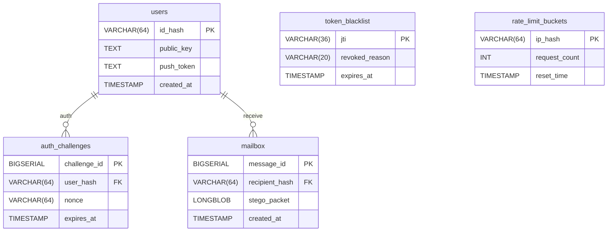

## Estructura de Persistencia y Modelado de Datos

## 1. Modelo de Persistencia de Conocimiento Cero

La arquitectura de datos de Hermnet sigue el principio de **Zero-Knowledge Architecture**. El servidor actúa como un relé de almacenamiento temporal (Store-and-Forward) para bloques de datos cifrados, desacoplando la transmisión de mensajes del conocimiento de su contenido.

El diseño de la base de datos prioriza:
*   **Efimeridad:** Los datos sensibles (mensajes) tienen un ciclo de vida limitado y se eliminan tras su entrega.
*   **Seguridad:** Minimización de metadatos persistentes.
*   **Integridad:** Estructuras optimizadas para la validación criptográfica y el enrutamiento.

## 2. Esquema Relacional de Base de Datos

El sistema backend gestiona un conjunto reducido de tablas para soportar la autenticación, el enrutamiento y la seguridad operativa.

### Diagrama Entidad-Relación

### A. Tabla `users` (Directorio Público)
La única tabla persistente. Necesaria para validar firmas y enrutar.

| Columna | Tipo SQL | Restricciones | Para qué sirve (Lógica) |
| :--- | :--- | :--- | :--- |
| `id_hash` | VARCHAR(64) | PK, Not Null | El ID (HNET-7a...). Validar siempre formato con Regex. |
| `public_key` | TEXT | Not Null | La llave pública para el cifrado asimétrico. |
| `push_token` | TEXT | Nullable | Token de Firebase/APNs para notificaciones ciegas. |
| `created_at` | TIMESTAMP | Default NOW() | Fecha de alta técnica. |

### B. Tabla `auth_challenges` (Login Zero-Knowledge)
Tabla volátil para el protocolo de entrada sin contraseñas.

| Columna | Tipo SQL | Restricciones | Para qué sirve (Lógica) |
| :--- | :--- | :--- | :--- |
| `challenge_id` | BIGSERIAL | PK, AutoInc | ID interno. |
| `user_hash` | VARCHAR(64) | FK -> users | Quién hace login. |
| `nonce` | VARCHAR(64) | Unique | El reto aleatorio que el móvil debe firmar. |
| `expires_at` | TIMESTAMP | Not Null | TTL estricto (30 seg). Cron job de limpieza por minuto. |

### C. Tabla `token_blacklist` (Seguridad de Sesión)
Lista negra para invalidar sesiones antes de tiempo.

| Columna | Tipo SQL | Restricciones | Para qué sirve (Lógica) |
| :--- | :--- | :--- | :--- |
| `jti` | VARCHAR(36) | PK | UUID del Token JWT revocado. |
| `revoked_reason` | VARCHAR(20) | Nullable | 'LOGOUT', 'SECURITY'. |
| `expires_at` | TIMESTAMP | Not Null | Fecha fin del token original. |

### D. Tabla `mailbox` (Buzón de Paquetes Esteganográficos)
Almacena los "contenedores" (imágenes predefinidas con datos inyectados).

| Columna | Tipo SQL | Restricciones | Para qué sirve (Lógica) |
| :--- | :--- | :--- | :--- |
| `message_id` | BIGSERIAL | PK | ID del paquete. |
| `recipient_hash` | VARCHAR(64) | Indexado | Destinatario del paquete. Crear Índice B-Tree. |
| `stego_packet` | LONGBLOB | Not Null | La imagen PNG estandarizada (Payload). |
| `created_at` | TIMESTAMP | Default NOW() | Fecha de recepción. |

**Control de Integridad de Payloads:**
*   El controlador de ingestión de mensajes implementa validaciones estrictas a nivel de byte. Se rechazan peticiones que no cumplan con la firma de archivo PNG y el tamaño exacto predefinido por el protocolo de esteganografía, mitigando ataques de denegación de servicio o inyección de archivos maliciosos.

### E. Tabla `rate_limit_buckets` (Defensa Anti-Abuso)
Control de tráfico para usuarios anónimos.

| Columna | Tipo SQL | Restricciones | Para qué sirve (Lógica) |
| :--- | :--- | :--- | :--- |
| `ip_hash` | VARCHAR(64) | PK | Hash diario de la IP (SHA-256 + Salt). |
| `request_count` | INT | Default 0 | Contador de peticiones. |
| `reset_time` | TIMESTAMP | Not Null | Cuándo se reinicia el contador. |

## 3. Control de Escenarios y Errores (Edge Cases)

Instrucciones para que el programador blinde el código ante ataques comunes.

### Escenario 1: Intento de subir "Archivos Basura"
*   **Situación:** Un atacante intenta usar la API para subir una película o un virus `.exe` renombrado a `.png`.
*   **Control (Magic Numbers):** El servidor no se fía de la extensión. Lee los primeros bytes del archivo (Cabecera).
    *   Si no empieza por `89 50 4E 47` (Firma PNG), rechaza la petición.
*   **Control (Tamaño Estricto):** Como usamos imágenes predefinidas normalizadas, sabemos que el peso siempre debe ser X.
    *   Si `file.size > LIMIT_SIZE` -> Error 413 (Payload Too Large).

### Escenario 2: Ataque de Inundación (Mailbox Flooding)
*   **Situación:** Alguien envía 500 mensajes seguidos a un usuario para llenarle el buzón y colapsar el disco del servidor.
*   **Solución (Cuota Rígida):**
    *   Antes de aceptar un INSERT en `mailbox`, consultar: `SELECT COUNT(*) FROM mailbox WHERE recipient_hash = ?`.
    *   **Límite:** Si el destinatario tiene > 50 mensajes pendientes de leer, el servidor responde `429 Too Many Requests` al emisor.
    *   **Mensaje al Usuario:** "El buzón de HNET-7a... está lleno. Inténtalo más tarde".

### Escenario 3: Mensajes Huérfanos
*   **Situación:** Un usuario pierde el móvil y nunca descarga sus mensajes. Esos mensajes ocupan espacio en disco eternamente.
*   **Solución (TTL - Time To Live):**
    *   Configurar un proceso en segundo plano (Spring Scheduler) que se ejecute cada hora.
    *   Query: `DELETE FROM mailbox WHERE created_at < NOW() - INTERVAL '48 HOURS'`.
    *   Esto garantiza que el servidor se "autolimpie" y nunca guarde datos antiguos.

### Escenario 4: Concurrencia en Login
*   **Situación:** El usuario pulsa "Entrar" muchas veces seguidas, generando múltiples retos.
*   **Solución:** La tabla `auth_challenges` debe tener una restricción UNIQUE sobre el `nonce`, pero permitir múltiples filas por usuario. El Garbage Collector limpiará las viejas.

## 4. Instrucciones de Despliegue (DevOps)
*   **Sin Logs de Payload:** Configurar el servidor para que NUNCA escriba en los logs el contenido del `stego_packet` ni su tamaño. Solo "Message received for HNET-X".
*   **Base de Datos Efímera:** Considerar que la tabla `mailbox` es de alto tráfico de escritura/borrado. Se recomienda ejecutar un `VACUUM` (en PostgreSQL) o `OPTIMIZE TABLE` (en MySQL) periódicamente para recuperar espacio en disco.

